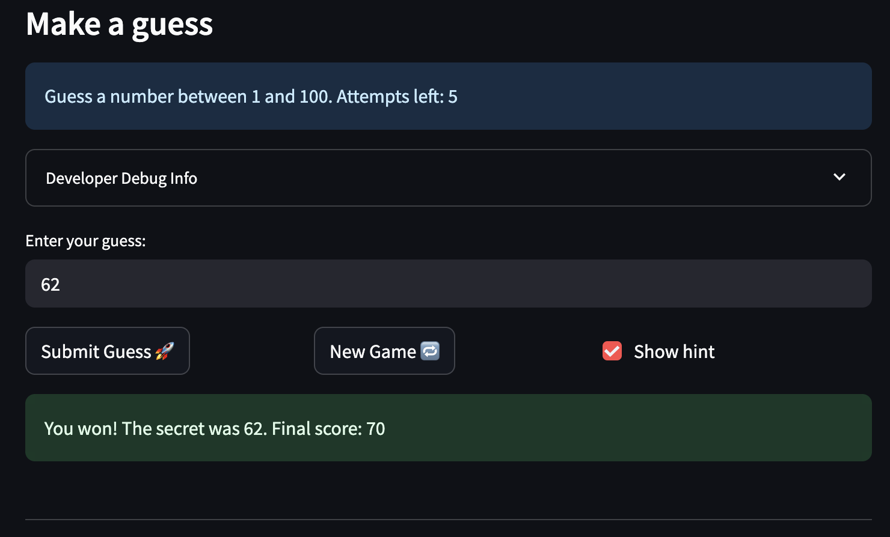

# 🎮 Game Glitch Investigator: The Impossible Guesser

## 🚨 The Situation

You asked an AI to build a simple "Number Guessing Game" using Streamlit.
It wrote the code, ran away, and now the game is unplayable. 

- You can't win.
- The hints lie to you.
- The secret number seems to have commitment issues.

## 🛠️ Setup

1. Install dependencies: `pip install -r requirements.txt`
2. Run the broken app: `python -m streamlit run app.py`

## 🕵️‍♂️ Your Mission

1. **Play the game.** Open the "Developer Debug Info" tab in the app to see the secret number. Try to win.
2. **Find the State Bug.** Why does the secret number change every time you click "Submit"? Ask ChatGPT: *"How do I keep a variable from resetting in Streamlit when I click a button?"*
3. **Fix the Logic.** The hints ("Higher/Lower") are wrong. Fix them.
4. **Refactor & Test.** - Move the logic into `logic_utils.py`.
   - Run `pytest` in your terminal.
   - Keep fixing until all tests pass!

## 📝 Document Your Experience

- [ ] Describe the game's purpose.
   A number guessing game built with Streamlit. The app picks a secret number inside a range set by the difficulty (Easy 1–20, Normal 1–100, Hard 1–200), and you guess until you find it or run out of attempts. After each guess it tells you whether you were too high or too low, and awards points based on how few attempts it took.

- [ ] Detail which bugs you found.
   The directional hints were reversed, so every "too high" guess told you to go higher; the secret was cast to a string on every even-numbered attempt, which made 50 == "50" false and meant a correct guess literally could not win; and the New Game button reset only the attempt counter and the secret, leaving the game's status as "won" or "lost" so the round stayed over and the difficulty settings were inverted.

- [ ] Explain what fixes you applied.
   Refactored the four pure functions — check_guess, parse_guess, get_range_for_difficulty, and update_score — out of app.py into logic_utils.py. 
   Fixed each bug at its source: swapped the hint directions, removed the str() cast and deleted the dead string-comparison fallback it was feeding, corrected the scoring arithmetic, rejected decimals and out-of-range guesses, and widened Hard's range so difficulty actually scales.

## 📸 Demo Walkthrough

Describe your fixed game in numbered steps so a reader can follow along without watching a video:

1. User enters a guess of 90
2. Game returns "Too Low"
3. User enters a guess of 99 → "Too High"
4. User enters a guess of 95 → "Win"
5. Game ends after the correct guess

**Screenshot** *(optional)*: <!-- Insert a screenshot of your fixed, winning game here -->

## 🧪 Test Results

```
collected 28 items                                                                  

tests/test_game_logic.py ............................                                                                                                                                                                                                [100%]

============================= 28 passed in 0.02s ====================================
```

## 🚀 Stretch Features

- [ ] [If you choose to complete Challenge 4, describe the Enhanced UI changes here — a screenshot is optional]
